# Video Cut& paste 报告

实现的是SIGGRAPH05的paper

## 人员分工

1. 连宇哲 3d-graphcut
2. 陆家林 bi-tracking local refine
3. 张伟锋 gui

## Usage

### prerequisite

> Assume that you have a unix-like or linux operating system.

You will need to have these software installed in your system path(in order for the Cmake to find the package)

1. **QT5**(for GUI)
2. **ffmpeg**
3. **opencv**
4. **G++** (or other C++ compiler)

### how to make

run these scripts in your terminal.

```
cmake .
make all
```

or you can specify what interface you want to marked

```
make gui
```

for making a QT5 GUI client

or just

```
make cmd_test
```

to run the code without a GUI.

the executable cmd_test will read video path under "./data/news.avi" and keyframes under "./data/source/keyframe/news.avi"

The executable program is located in Directory `exe/gui` and `exe/cmd_test`.

you can run

```
`./exe/gui`
```

or

```
`./exe/cmd_test`
```

to launch the program.

**ATTENTION**: you must run the executable in the root path of the repo.

### 论文原理

#### key frame

首先论文是基于已经手动标示的关键帧，寻找关键帧和前后帧之间的关系，通过3D graph对于其他非关键帧进行前景色和背景色进行分割，然后在对于分割好的结果，采用论文中提到的Local refinement by tracking和Bi-directional feature tracking进行优化。下图是论文中的系统基本架构<br>
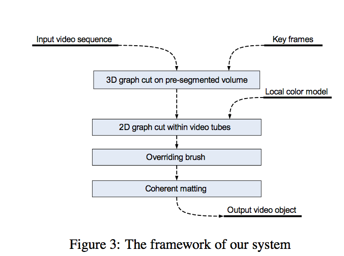<br>

#### 3D graph cut

<br>
3D graph cut是在2D graph cut的基础上改进而来。3D graph cut主要内容是采用高斯混合模型来对于前景色和背景色进行分类。首先其高斯混合模型是由初始时候的前景色和背景色进行初始化的到。论文中对于关键帧采用分水岭算法，将其分成几个区域。<br>
如下图，对于已经区分好的E3这一帧上的每一个区域，会连接着下一帧的很多区域，并且连接上第三帧的区域。<br>
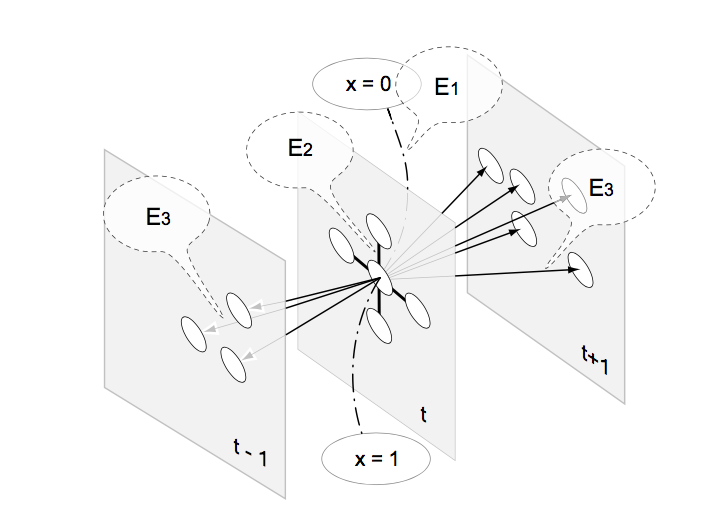<br>
对于3D graph cut我们对下面的公式进行优化。<br>
对于公式的第一项是最大似然值能量。对于能量E1,其前景色和背景色的模型是建立在关键帧的颜色例子上的。使用高斯混合模型(GMM)来进行描述其前景色和背景色的颜色分布。论文中表示，一般高斯混合模型由6个component组成。<br>
E2和E3两个能量是由两个区域的相似度来定义的。<br>
然后我们对于下面的这个公式求最小值，也就是求能量的最小值，这样我们就能求得他们的区域最终连接的位置。然后对其进行切割。然后就能得到第二帧的图片有哪些区域是前景色，那些区域是背景色<br>
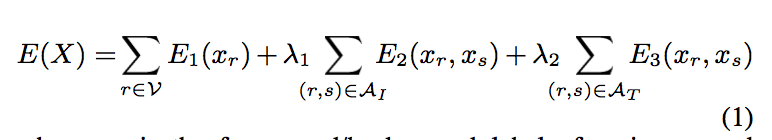<br>

#### Local refinement by tracking

对于video tub，每一帧都会有一个矩形的窗口，但是用户只需要指定两个帧的的矩形窗口，一个初始帧和最后一帧。剩下的窗口会自动的通过bi-directional feature tracking算法进行生成。

local refine 会使用一个预定的颜色模型（GMM color model）来再继续做一个本地的颜色优化，其实也就是一个2d-graph cut，这个其实是一个使用先验的颜色模型（来自关键帧的详细划分作为ground truth），对于实际的效果是有很大帮助的。

#### bi-directional feature tracking algorithm.

对于Pt是作为在video tub中第t帧的窗口的中间位置，同时我们定义一个对于这个位置的搜索边界。然后我们对于下面的计算公式求解最小值。D这个函数代表着两个矩形窗口的颜色的距离。<br>
第一项是设计去优化颜色和关键帧最适配。第二项来似的video tub的窗口尽量的平滑。第三项是使得相邻的帧之间的颜色距离最小化。对于这个算法，我们采用的是DP动态规划的算法来进行求解。<br>
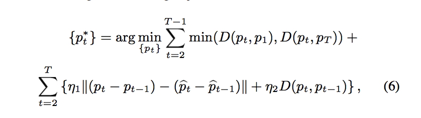<br>

### 代码实现

我们实现的代码是在像素级别上的，并没有按照论文中所采用的在区域级别，也就是我们并没有做分水岭算法 对于关键帧，我们可以用户手工进行大致区别前景色和背景色。然后我们将会优化这个用户手工指定的关键帧的前景色和背景色的分割

```
初始化前景色和背景色
初始化背景色高斯混合模型和前景色高斯混合模型
for:
  1.对于每一个像素点通过通过高斯混合模型，指定其为哪一个类别
  2.从这些像素点分类后进行学习，得到新的高斯混合模型参数
  3.采用最小割的方法，得到最优化的结果，也就是重新将像素点分类分成前景和背景色
  4.迭代直到其收敛
```

对于相邻的两帧，也就是我们对于已经区分好的前景色和背景色的一帧，和其相近的另外一帧。

```
对于区分好前景色和背景色帧得到的，进行膨胀，按照论文中，对于边界进行膨胀，按照论文中的是向周围增加15个像素点。
然后对于其也采用上面类似的方法进行求其前景和背景色
```

<br>
核心代码 doVideoCut

```
//对于temp_labels进行改变
    for(int i=0;i<temp_labels.size();i++)
    {
        cv::Mat change_labels=cv::Mat::zeros(temp_labels[0].rows,temp_labels[0].cols,CV_8UC1);
        for(int x=0;x<temp_labels[i].rows;x++)
        {
            bool booll=false;
            int flag=2;
            for(int y=0;y<temp_labels[i].cols;y++)
            {
                change_labels.at<uchar>(x,y)=flag;
                if(temp_labels[i].at<uchar>(x,y)>0)
                {
                    if(!booll){
                        booll=true;
                    }
                }else{
                    if(booll)
                    {
                        if(flag==2)
                            flag=3;
                        else
                            flag=2;
                    }
                    booll=false;
                }
            }
        }
        temp_labels[i]=change_labels.clone();
    }

    for(int i=0;i<keyframe_indexs.size();i++)
    {
        labels[keyframe_indexs[i]]=temp_labels[i].clone();
        cv::Rect rect(0,0,images[i+1].cols,images[i+1].rows);
        cv::Mat image_copy = images[keyframe_indexs[i]].clone();
        int s=keyframe_indexs[i];
        // save_label_image(labels[keyframe_indexs[i]],"data/source/label_before_er.png");

        // initial(labels[keyframe_indexs[i]],labels[keyframe_indexs[i]]);
        // save_label_image(labels[keyframe_indexs[i]],"data/source/label.png");
        // imwrite( "data/source/testafter_"+std::to_string(s)+".png", image_copy);
        cv::Mat bgdModel,fgdModel;
        cv::Mat l_old = labels[keyframe_indexs[i]].clone();
        cv::grabCut(image_copy,labels[keyframe_indexs[i]],rect,bgdModel,fgdModel,20,cv::GC_INIT_WITH_MASK);
        cv::Mat image_copy_new=image_copy.clone();
        std::cout << "done" << '\n';
        for(int j=0;j<image_copy.rows;j++){
            for(int k=0;k<image_copy.cols ;k++){
                labels[keyframe_indexs[i]].at<uchar>(j,k)&=0x1;
            }
        }
        // imwrite( "data/source/testaftergraphcut_"+std::to_string(s)+".png", labels[keyframe_indexs[i]]);

        for(int j=0;j<l_old.rows;j++){
            for(int k=0;k<l_old.cols ;k++){
                labels[keyframe_indexs[i]].at<uchar>(j,k)&= (l_old.at<uchar>(j,k)-2);
            }
        }

        // save_label_image_1(labels[keyframe_indexs[i]],"data/source/label_aftercut.png");
    }

    std::cout<< " label initial okay " <<std::endl;
    for(int i=0;i<keyframe_indexs.size()-1;i++)
    {
        int start_index=keyframe_indexs[i],end_index=keyframe_indexs[i+1];
        // if(start_index>)
        //     break;
        int interval=end_index-start_index;
        for(int j=0;j<interval-1;j++)
        {
            std::cout << "do optimize_3_frame" << std::endl;
            optimize_3_frame(j+start_index,images,labels);
        }
        bidirection_tracking(start_index,end_index,images,labels);
    }
```

```
void bidirection_tracking(int start_index,int end_index,std::vector<cv::Mat> &images,std::vector<cv::Mat> &labels)
{
    std::cout << "start bidirection tracking" << std::endl;
    #define MAX_ITERATION_NUM 10
    int interval=end_index-start_index;
    int row = labels[start_index].rows;
    int col = labels[start_index].cols;
    for(int i=start_index;i<=end_index;i++)
    {
        for(int j=0 ; j<row ; j++)
        {
            for(int k=0 ; k<col ; k++)
            {
                if( labels[i].at<uchar>(j,k)==1)
                    labels[i].at<uchar>(j,k)=255;
            }
        }
    }

    labels[end_index-1]=labels[end_index].clone();

    std::cout << "initialize tracking" << std::endl;
    for(int iter=0;iter<MAX_ITERATION_NUM;iter++)
    {
        for(int j=0;j<interval-1;j++)
        {
            // std::cout << "do bidirection trackingframe _3_frame" << std::endl;
            bidirection_tracking_3_frame(j+start_index,images,labels);
            bidirection_tracking_3_frame(interval-2-j+start_index,images,labels);
            // std::cout << "do bidirection reverse trackingframe _3_frame" << std::endl;
        }
    }
    save_label_image_1(labels[end_index-1],"data/testlabel11.png");
    save_label_image_1(labels[end_index-2],"data/testlabel10.png");
    for(int i=start_index;i<=end_index;i++)
    {
        for(int j=0 ; j<row ; j++)
        {
            for(int k=0 ; k<col ; k++)
            {
                if(labels[i].at<uchar>(j,k)>20)
                    labels[i].at<uchar>(j,k)=1;
            }
        }
    }
    save_label_image(labels[end_index-1],"data/testlabel11_after.png");
    save_label_image(labels[end_index-2],"data/testlabel10_after.png");
}
```

### 实现结果

<center>
  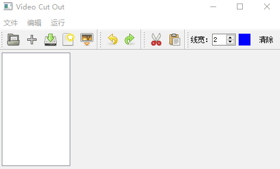
</center>

<br>

<center>初始界面</center>

<br>
按键从左到右是：导入源视频 导入关键帧 后面的按钮其实都没用的 没有完成 第三个是导入要粘贴的视频的 videocut的触发按钮

<center>
  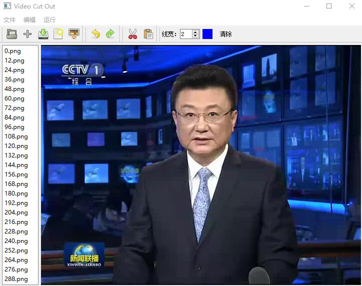
</center>

<center>导入视频</center>

<center>
  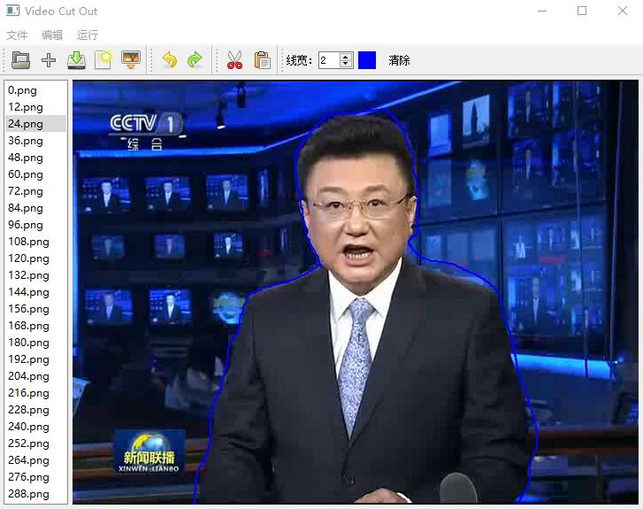
</center>

<center>绘制关键帧的用户指定前景和背景色</center>

<center>
  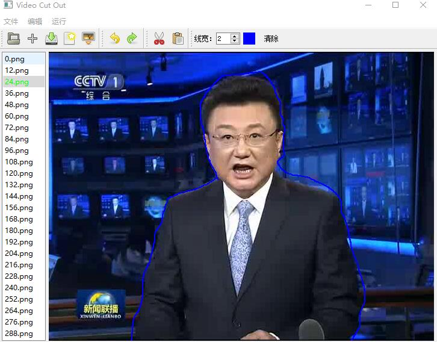
</center>

<center>保存用户会知道内容，这样右边会变成绿色</center>

<center>
  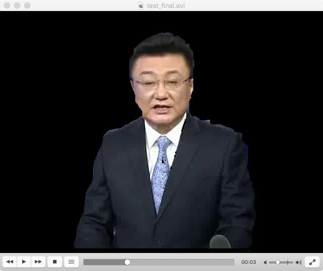
</center>

<center>结果视频截图</center>

我们首先对于一个视频，将其分解成很多的图片，也就是我们如图所示

<center>
  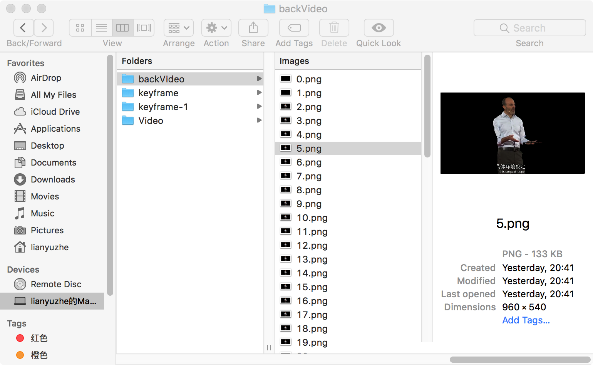
</center>

<center>通过关键帧，我们对分解得到的帧进行裁剪</center>

<center>
  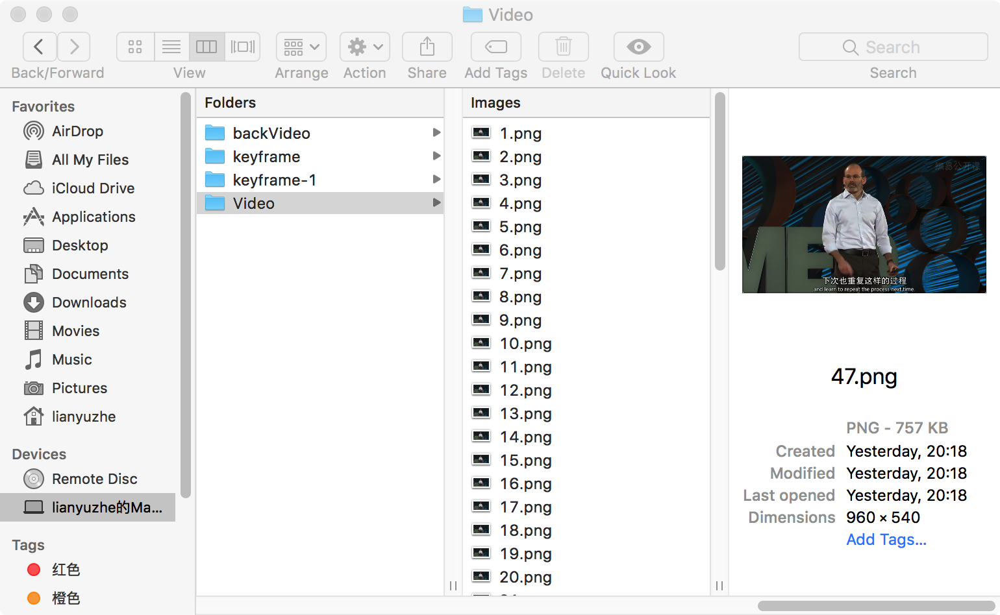
</center>

<center>分解视频到图片</center>

<center>
  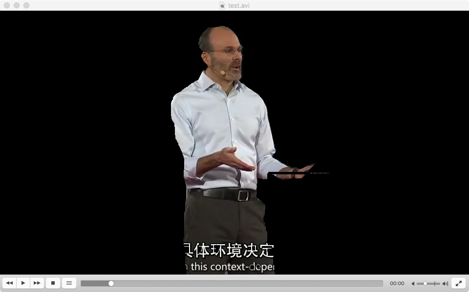
</center>

<center>合并后的视频结果</center>

### 结果总结

我们实现的结果前景和背景区分的分割不是很理想，可能首先我们对于论文上的理解有点错误，以及对于一篇论文不可能详细介绍其实现的每个具体细节，所以我们实现的过程上可能和论文存在着一些差距，还有就是我们觉得我们选的一些视频的前后背景区分度并不大，在选取了区分度大的视频之后，得到的结果稍微有点改善。
